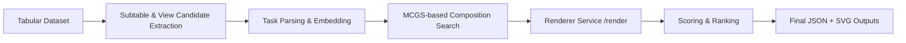

# VisPuzzle

Code repository for the paper **"VisPuzzle: Task-Aware Composite Visualization Construction"** (submitted to IEEE VIS 2026).

VisPuzzle automatically constructs high-quality composite visualizations from tabular data by combining:

- task-aware candidate analysis,
- Monte Carlo Graph Search (MCGS) over composition states,
- rendering-based quality evaluation.

---

## Overview

The repository contains two main components:

- **comp-vis-renderer/**: rendering engine and local HTTP render service
- **search/**: task-aware search, scoring, result ranking, and output generation

The intended workflow is:

1. Start the renderer service.
2. Run the search pipeline.

---

## Project Layout

```text
vispuzzle/
├── comp-vis-renderer/    # SVG renderer + /render service
└── search/               # Task-aware search and composition pipeline
```

---

## Pipeline



---

## Quick Start

### 1) Start Renderer Service

```bash
cd comp-vis-renderer
npm install
npm run service
```

By default, the renderer service is exposed at:

- `http://localhost:9840/render`

### 2) Run Search Pipeline

Open a new terminal:

```bash
cd search
pip install -r requirements.txt
python main.py
```

Example with explicit dataset:

```bash
python main.py
```

---

## Reproducibility Notes

### Automatic Subtable Bootstrapping

When running `main.py`, the pipeline checks whether the required file exists:

- `search/LLMChart/subtables/{dataset}_{theme_index}.pkl`

If missing, it automatically triggers subtable extraction before continuing.

### Output Directory

Default output root:

- `search/output_dir`

Per-run artifacts are written to:

- `search/output_dir/{dataset_name}/`

This folder includes both:

- ranked visualization-tree JSON results,
- rendered SVG files.

To override output path:

```bash
python main.py --output-dir your_output_path
```

---

## Optional Environment Variables

If you run everything locally with defaults, no extra setup is usually required.

To customize renderer endpoint:

```bash
export VISPUZZLE_RENDER_URL=http://localhost:9840/render
```

For LLM-backed features (e.g., embeddings, title generation, some scoring paths):

```bash
export VISPUZZLE_LLM_API_KEY=your_api_key
export VISPUZZLE_LLM_BASE_URL=https://your-endpoint/v1
```

---

## Additional Documentation

- `search/README.md`
- `comp-vis-renderer/README.md`
